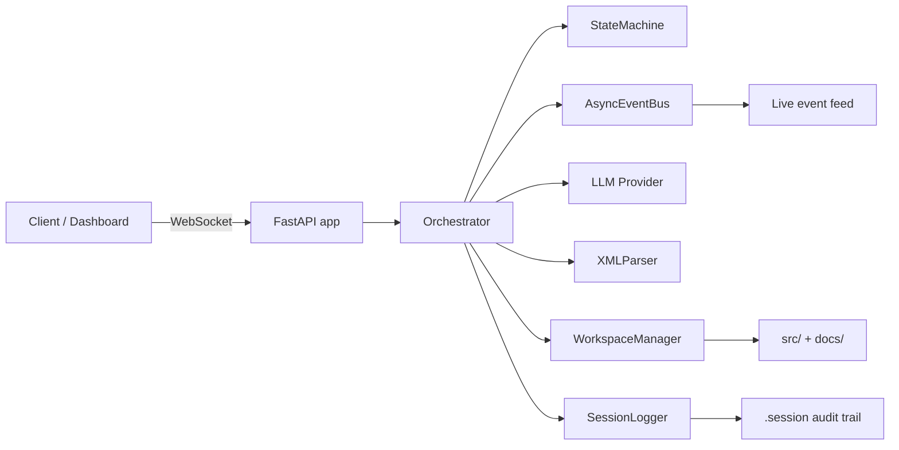
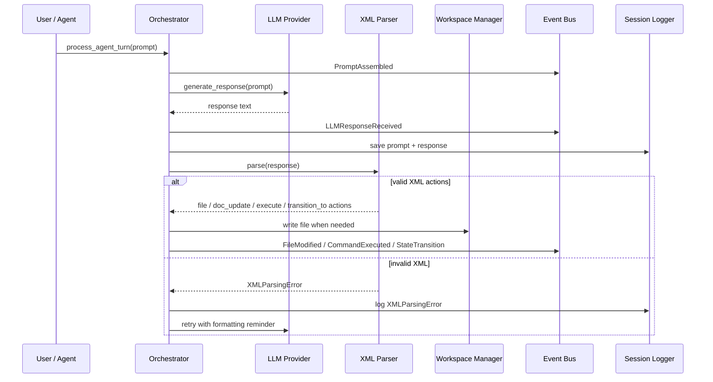
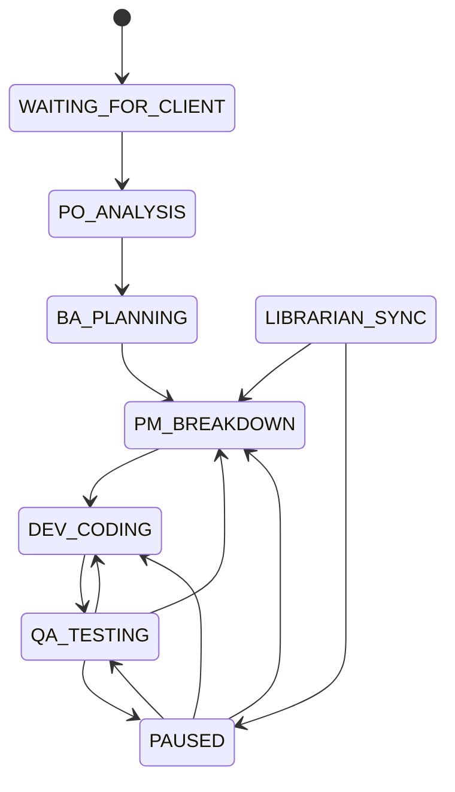

# Hermes Orchestrator Guide

This document explains how the Hermes orchestrator works, how data moves through the system, and how different teams can use it in day-to-day work.

## What Hermes does

Hermes is an event-driven orchestrator that:

- receives prompts for the active workflow state
- sends the prompt to an LLM provider
- parses XML-like handoff tags from the response
- writes approved changes to `src/` or `docs/`
- emits live events over WebSockets for dashboard consumers
- stores prompts, responses, and event logs under `.session/`

## Main building blocks



## Runtime flow



## Workflow states



### State intent

| State | Purpose |
| --- | --- |
| `WAITING_FOR_CLIENT` | Idle entry state before work starts. |
| `PO_ANALYSIS` | Clarifies business needs and scope. |
| `BA_PLANNING` | Converts requirements into structured analysis. |
| `PM_BREAKDOWN` | Splits work into actionable tasks. |
| `DEV_CODING` | Produces code or documentation changes. |
| `QA_TESTING` | Validates outputs and decides whether work loops back. |
| `LIBRARIAN_SYNC` | Intended for documentation and memory synchronization. |
| `PAUSED` | Manual hold state controlled from the dashboard. |

## Supported response actions

Hermes currently understands these handoff tags:

| Tag | Effect |
| --- | --- |
| `<file path="..." action="create|update|upsert">` | Writes content into an allowed repository path under `src/` or `docs/`. |
| `<doc_update path="..." action="create|update|upsert">` | Writes content into `docs/` paths. |
| `<execute>` | Emits a `CommandExecuted` event for the dashboard/audit flow. |
| `<transition_to>` | Moves the state machine to another allowed state. |

### Important operational rules

- Only `src/` and `docs/` are writable through the workspace manager.
- Path traversal is blocked before any write occurs.
- Prompt/response pairs are saved per session in `.session/<timestamp>/prompts/`.
- Event payloads are broadcast to dashboard WebSocket clients on `/ws/dashboard`.
- If the LLM response has no valid tags, Hermes retries with a strict formatting error message.

## Event stream reference

The dashboard and audit trail can receive these event types:

- `PromptAssembled`
- `LLMResponseReceived`
- `FileModified`
- `StateTransition`
- `CommandExecuted`
- `XMLParsingError` (logged through the session logger during retry scenarios)

## Typical operator flow

1. Start the backend service.
2. Connect a dashboard client to `ws://localhost:8000/ws/dashboard`.
3. Submit or trigger a prompt for the active state.
4. Watch live events as Hermes logs prompts, parses actions, and updates files.
5. Pause or resume the pipeline from the control panel when human review is needed.

## Usage examples by audience

### 1. Engineering / dev team

Use Hermes when the team wants a controlled handoff loop between planning, coding, and QA.

Example:

1. Product context is prepared in `docs/01_Product/`.
2. The prompt instructs the current role to return only valid handoff tags.
3. Hermes writes new implementation files into `src/` and design notes into `docs/`.
4. QA reviews the event stream and session logs to verify the change path.

Why this helps:

- fast traceability from prompt to output
- clear state transitions
- safer file writes through path restrictions
- easier debugging through `.session` audit files

### 2. Marketing team

Use Hermes as a structured content pipeline when marketing needs technical information converted into release-ready material.

Example:

1. Marketing adds source material such as campaign notes, launch goals, or product positioning into `docs/01_Product/` or `docs/02_Analysis/`.
2. A workflow state prepares a summarized document using `<doc_update>` tags.
3. The result is stored in `docs/`, where it can be reviewed before publishing elsewhere.

Possible outputs:

- launch briefs
- release note drafts
- feature summaries
- internal enablement documents

### 3. Product and business analysis

Use Hermes to move from an idea to a tracked implementation path.

Example:

1. Product owner captures the client problem.
2. BA planning expands it into constraints and solution notes.
3. PM breakdown turns it into concrete work items.
4. Development and QA continue the loop until the task is accepted.

Why this helps:

- one visible workflow from concept to delivery
- consistent handoff structure between roles
- documentation stays close to the implementation trail

### 4. QA and audit stakeholders

Use Hermes when validation history matters as much as the final output.

Example:

1. QA monitors `StateTransition`, `FileModified`, and `CommandExecuted` events.
2. The `.session` directory is inspected to compare prompt intent with generated output.
3. Retry events show when the model had to be corrected for malformed responses.

This is useful for:

- release readiness reviews
- regression investigations
- internal process audits
- postmortem evidence collection

## Developer quick start

### Start the backend

On Windows:

- run `start_project.bat` from the repository root

On other platforms:

```bash
python -m pip install -r requirements.txt
python -m uvicorn main:app --host 127.0.0.1 --port 8000 --reload
```

### Connect to the dashboard socket

The frontend WebSocket service uses:

```text
ws://localhost:8000/ws/dashboard
```

### Agent links mode

The dashboard also exposes an agent-link view backed by:

```text
/api/dashboard/agent-network
```

This mode is designed to:

- show every persona and control node in one place
- show outgoing links for each agent
- highlight the current agent and active paths for the current workflow state
- refresh when `StateTransition` events arrive over the dashboard socket

### Pause and resume examples

```json
{ "command": "PAUSE" }
```

```json
{ "command": "RESUME" }
```

### Example response payload from an agent

```xml
<doc_update path="docs/architecture/example.md" action="upsert">
Updated architecture notes
</doc_update>
<transition_to>PM_BREAKDOWN</transition_to>
```

## Suggested future documentation extensions

- add a dedicated dashboard setup guide once the Angular app has a full bootstrapping flow
- document how prompts are assembled per role/persona
- add sample session log excerpts for onboarding new contributors
